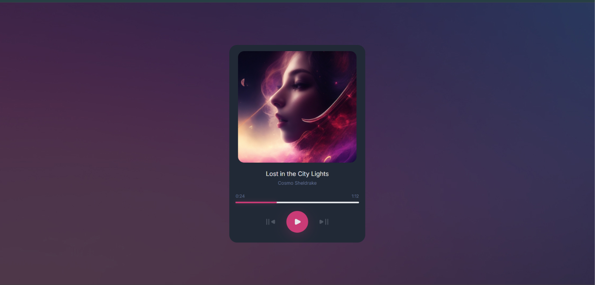

<h1 align="center">Music Player | devChallenges</h1>

   Solution for a challenge <a href="https://devchallenges.io/challenge/music-player" target="_blank">Music Player
</a> from <a href="http://devchallenges.io" target="_blank">devChallenges.io</a>.

<!-- TABLE OF CONTENTS -->

## Table of Contents

- [Overview](#overview)
  - [What I learned](#what-i-learned)
  - [Useful resources](#useful-resources)
- [Built with](#built-with)
- [Features](#features)
- [Contact](#contact)
- [Acknowledgements](#acknowledgements)

<!-- OVERVIEW -->

## Overview

<!-- Replace the screenshot above with an actual screenshot of your running app before submitting -->

This is a vanilla JavaScript music player that lets users play/pause a track, skip to the next or previous song, and see live playback progress with a custom progress bar — built without any external audio libraries.

### What I learned

- How to sync a custom-styled progress bar with a native `<audio>` element using the `timeupdate` and `loadedmetadata` events, instead of relying on the default (hard-to-style) `<input type="range">` slider.
- Implementing click-to-seek functionality using `getBoundingClientRect()` to convert a mouse click's screen position into a percentage of the progress bar's width, then mapping that to the audio's `currentTime`.
- Managing player state (play/pause icon swap, current song index) with plain JavaScript variables instead of a framework, and using the modulo operator (`%`) to handle next/previous song wraparound cleanly.
- Debugging silent JavaScript errors caused by mismatched variable names between HTML `id`s and `document.getElementById()` calls.

### Useful resources

- [MDN — HTMLMediaElement](https://developer.mozilla.org/en-US/docs/Web/API/HTMLMediaElement) - Reference for `currentTime`, `duration`, and audio events like `timeupdate` and `loadedmetadata`.
- [MDN — getBoundingClientRect()](https://developer.mozilla.org/en-US/docs/Web/API/Element/getBoundingClientRect) - Helped me understand how to calculate click position relative to an element for the seek bar feature.

### Built with

- Semantic HTML5 markup
- CSS3 (Flexbox)
- Vanilla JavaScript (ES6+)
- HTML5 `<audio>` API

## Features

- Play and pause the current song via a custom play/pause button with icon swapping
- Skip to the next or previous song, with automatic wraparound (looping from last song back to first, and vice versa)
- Cover image, song title, and artist name update dynamically when switching songs
- Custom-styled progress bar that fills in real time based on actual audio playback
- Click-to-seek: click anywhere on the progress bar to jump playback to that position
- Live current time / total duration display in `mm:ss` format

## Acknowledgements

- [devChallenges.io](https://devchallenges.io) - For the design and challenge specification.

## Author

- Website [divyanshi145.github.io/MusicPlayer/](https://divyanshi145.github.io/MusicPlayer/)
- GitHub [@Divyanshi145](https://github.com/Divyanshi145)
